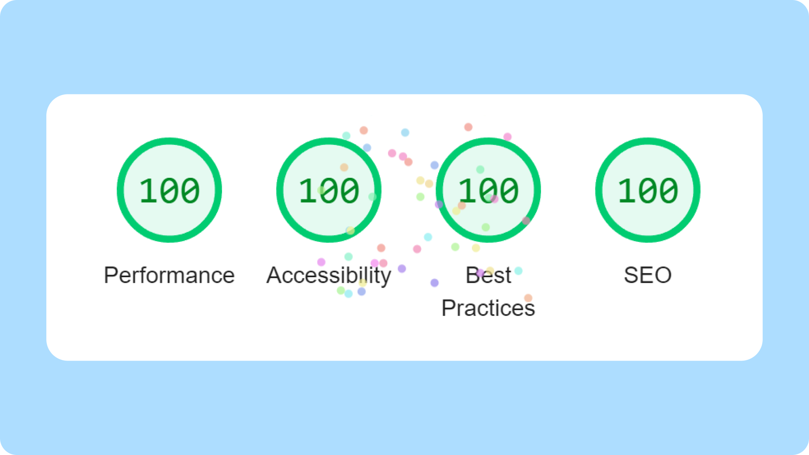

# 🚧 amparo.codes

This repo contains the code for my personal portfolio website, currently **under construction**.

I'll be updating the README as soon as I make significant changes.

😃👉 [Visit the website](https://amparo.codes)

## 🧰 Tech stack

Designed and prototyped in Figma.

Built with:

- Astro
- React
- Javascript
- Sass

Deployed on Cloudflare.

<!--
## 📐 Prototypes (Figma)

- [Desktop view](https://www.figma.com/proto/pKkpIP8lCASbhEr4iC0atA/Frontend-Portfolio-Website?page-id=72%3A1891&type=design&node-id=206-2061&viewport=554%2C341%2C0.19&scaling=scale-down&starting-point-node-id=206%3A2061&show-proto-sidebar=1)
- [Mobile view (Portrait)](https://www.figma.com/proto/pKkpIP8lCASbhEr4iC0atA/Frontend-Portfolio-Website?page-id=298%3A2468&type=design&node-id=298-2491&viewport=790%2C487%2C0.5&scaling=scale-down&starting-point-node-id=298%3A2491)
- [Tablet view (Portrait)](https://www.figma.com/proto/pKkpIP8lCASbhEr4iC0atA/Frontend-Portfolio-Website?page-id=298%3A2787&type=design&node-id=298-2788&viewport=727%2C487%2C0.47&scaling=scale-down&starting-point-node-id=298%3A2788)
-->

## 🧭 Roadmap

### ✅ What's done

- Content

- Assets

- Mobile styling

- Desktop styling

### 👷‍♀️ What I'm working on

- Styling 404 page

- Tablet styling

### 🔮 Future plans

Needless to say, in the near future, I'll be adding:

- projects, and

- an "About" section.

In addition, I plan to implement the following enhancements:

- Dark mode: all colours and assets have already been chosen/designed/exported, they’re just waiting to be implemented.

- Theme toggle: add required functionality to the theme toggle to be able to switch between light and dark mode.

## 🔬 Lighthouse scores

Here are the lighthouse scores for the website, as of 23 June 2023:

Gotta love seeing those fireworks! (Or is it confetti? 🎉) Anyway, when it comes to the performance side of things, it's all thanks to [Astro](https://astro.build) 🚀.

## ♻ Sustainability scores

There's always room for improvement, as there are more factors to consider when it comes to sustainable web design / development, but I'm pretty happy with these scores.

## 📝 Observations

### Accessibility

#### Colour contrast and readability

During the design phase, I paid close attention to colour contrast by using tools like [WebAIM's Contrast Checker](https://webaim.org/resources/contrastchecker/), and, lately my favourite, [WhoCanUse](https://www.whocanuse.com/). This allowed me to ensure that the colour combinations used in the design met accessibility standards and provide optimal readability for all users.

Additionally, I made specific content design decisions to enhance readability and ease-of-use, considering factors such as font size, spacing, and layout.

#### Semantic HTML

As I do in all my projects, I prioritised the use of semantic HTML elements. Whenever possible, I chose appropriate tags for the content. For example, using the `<address>` tag for social media links, rather than `<nav>` as it conveys the purpose accurately without implying navigation.

#### ARIA labels

Added ARIA labels to elements, ensuring that non-textual content, interactive elements, and more complex components are properly labeled. This enables screen readers to provide meaningful and contextual information to users.

#### Keyboard accessibility

Made sure all interactive elements, including buttons and navigation, are easily accessible using a keyboard alone, and receive focus and behave intuitively.

#### Avoiding clutter in the accessibility tree

To prevent unnecessary distractions for screen reader users, I took care to exclude decorative elements from the accessibility tree. This ensures that users receive relevant and meaningful information without being overwhelmed by excessive detail.

#### Third-party tools

To enhance the accessibility evaluation process, I use browser extensions and accessibility testing tools like Chrome DevTools' [CSS Overview](https://developer.chrome.com/docs/devtools/css-overview/), and [axe DevTools](https://chrome.google.com/webstore/detail/axe-devtools-web-accessib/lhdoppojpmngadmnindnejefpokejbdd), amongst others.
